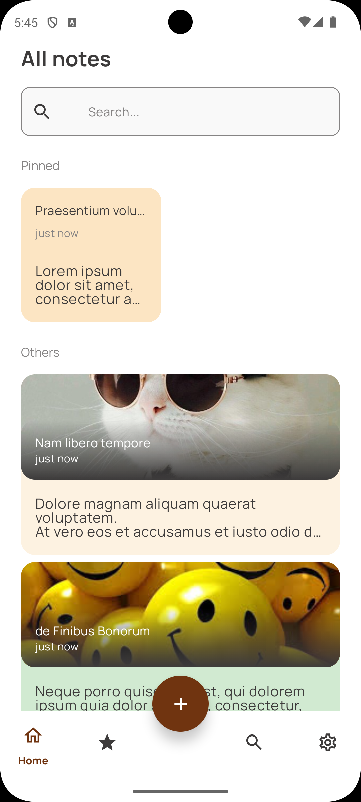

# 📝 CMP Notes — Kotlin Multiplatform Project

Beautiful and functional Notes application built with **Compose Multiplatform**. One codebase for both Android and iOS.

---

## 📱 Screenshots

<table style="width:100%">
  <tr>
    <th width="50%">Android</th>
    <th width="50%">iOS</th>
  </tr>
  <tr>
    <td></td>
    <td></td>
  </tr>
  <tr>
    <td align="center"><i>Place for Android Screenshot</i></td>
    <td align="center"><i>Place for iOS Screenshot</i></td>
  </tr>
</table>

*(Add your screenshots to the `/screenshots` folder and update the links above)*

---

## ✨ Features

- **Multiplatform UI**: Unified UI using Jetpack Compose across Android and iOS.
- **Notes Management**: Create, edit, and delete notes with ease.
- **Rich Content**: Support for text and images within notes.
- **Local Persistence**: Offline-first approach using a local database.
- **Clean Architecture**: Organized into `domain`, `data`, and `presentation` layers.
- **Dependency Injection**: Powered by Koin.
- **Dark Mode**: Support for system theme switching.

---

## 🛠 Tech Stack

### Core
- **[Kotlin Multiplatform](https://kotlinlang.org/docs/multiplatform.html)**: Share business logic across Android and iOS.
- **[Compose Multiplatform](https://www.jetbrains.com/lp/compose-multiplatform/)**: Shared UI framework for building native interfaces.

### Libraries
- **Dependency Injection**: [Koin](https://insert-koin.io/) (Core, Android, and Compose support).
- **Database**: [Room](https://developer.android.com/kotlin/multiplatform/room) with SQLite Bundled and KSP for multiplatform persistence.
- **Navigation**: [Jetpack Navigation Compose](https://developer.android.com/jetpack/compose/navigation) (Multiplatform version).
- **Architecture**: [AndroidX Lifecycle](https://developer.android.com/jetpack/androidx/releases/lifecycle) (ViewModel) integrated for shared logic.
- **Image Loading**: [Coil](https://coil-kt.github.io/coil/) (Multiplatform support).
- **Serialization**: [Kotlinx Serialization](https://github.com/Kotlin/kotlinx.serialization) for JSON handling.
- **Date & Time**: [Kotlinx Datetime](https://github.com/Kotlin/kotlinx.datetime) for platform-agnostic time management.
- **Coroutines**: [Kotlinx Coroutines](https://github.com/Kotlin/kotlinx.coroutines) for asynchronous operations.

---

## 📂 Project Structure

- `composeApp/src/commonMain`: Shared logic, ViewModels, and UI components.
- `composeApp/src/androidMain`: Android-specific implementations and resources.
- `composeApp/src/iosMain`: iOS-specific implementations.
- `iosApp`: Entry point for the iOS application.

---

## 🚀 Getting Started

### Prerequisites
- Android Studio / IntelliJ IDEA
- Xcode (for iOS development)
- Kotlin Multiplatform Mobile plugin

### Build & Run
1. **Android**: Select `composeApp` in the run configurations and click **Run**.
2. **iOS**: Open `iosApp/iosApp.xcworkspace` in Xcode or run via the IDE's iOS configuration.

---

## 📄 License
This project is licensed under the MIT License - see the [LICENSE](LICENSE) file for details.
